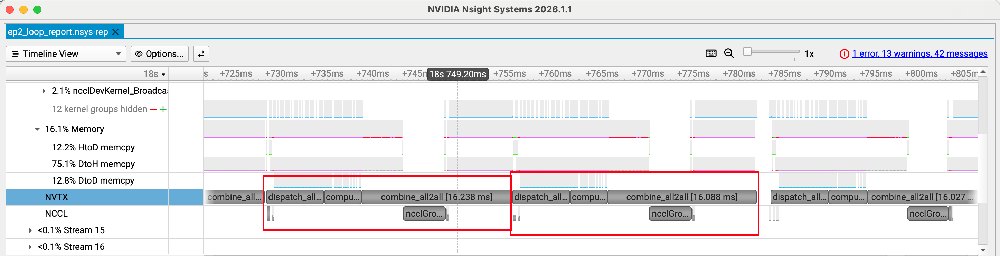

# 怎么用？

单卡 + NVTX：
```
nsys profile -o report --force-overwrite true --trace=cuda,nvtx,osrt \
  python bench/bench_ep_moe.py --batch-size 8 --hidden-dim 256 --warmup 5 --iters 20

```

多卡+NVTX：
```
nsys profile -o report --force-overwrite true --trace=cuda,nvtx,osrt \
  python bench/bench_ep_moe_multi.py --world-size 2 --backend nccl --mode both --batch-size 8 --hidden-dim 256 --warmup 5 --iters 20
```

生成report.nsys-rep

# 怎么看？

* GUI：nsys-ui report.nsys-rep，在 “Timeline” 里看 NVTX Ranges/Markers
* CLI：nsys stats report.nsys-rep 看汇总；nsys export --type=sqlite report.nsys-rep 再用 sqlite 查 NVTX 相关表

## 想看“kernel launch 开销减少了没”怎么跑？

关键点：**别在多卡 e2e 里看**（通信会淹没计算差异），要在单卡/无通信场景把“很多小 kernel launch”放大，然后看 `cudaLaunchKernel`/kernel instances 的变化。

### 1) 用 CUDA profiler API 把采样窗口卡在 steady-state iters

bench 脚本已支持 `--cuda-profiler`，会在“正式 iters”外调用 `torch.cuda.profiler.start/stop()`。

对应 nsys 用：
```
nsys profile -o report --force-overwrite true \
  --capture-range=cudaProfilerApi --capture-range-end=stop \
  --trace=cuda,nvtx,osrt \
  python bench/bench_ep_moe.py --device cuda --cuda-profiler --mode loop --warmup 20 --iters 200 \
    --num-experts 256 --experts-per-token 1 --batch-size 256 --hidden-dim 256
```

这组参数的目的：**每个 expert 平均只有 0~1 个 token**，loop 路径会触发大量小 GEMM/小 kernel，从而把 launch 开销暴露出来。

对比 batched_gemm（建议单独生成一个 report）：
```
nsys profile -o report_bmm --force-overwrite true \
  --capture-range=cudaProfilerApi --capture-range-end=stop \
  --trace=cuda,nvtx,osrt \
  python bench/bench_ep_moe.py --device cuda --cuda-profiler --mode batched_gemm --warmup 20 --iters 200 \
    --num-experts 256 --experts-per-token 1 --batch-size 256 --hidden-dim 256
```

（多卡也可以同样思路，只是更容易被通信掩盖）
```
nsys profile -o report --force-overwrite true \
  --capture-range=cudaProfilerApi --capture-range-end=stop \
  --trace=cuda,nvtx,osrt \
  python bench/bench_ep_moe_multi.py --cuda-profiler --world-size 2 --backend nccl --mode loop \
    --batch-size 256 --hidden-dim 256 --warmup 20 --iters 200
```

### 2) 用 stats 看“launch 次数/launch 时间”

对比 loop vs batched_gemm 两个 report，重点看：
```
nsys stats report.nsys-rep --report cuda_api_sum,cuda_gpu_kern_sum,nvtx_sum
```

- `cuda_api_sum`：关注 `cudaLaunchKernel`（以及可能的 `cuLaunchKernel`）的 **Time / Calls** 是否明显下降。
- `cuda_gpu_kern_sum`：关注 GEMM/elementwise/copy kernel 的 **Instances** 数量变化（loop 往往是很多小 GEMM；batched_gemm 往往是更少但更大的一次/少数几次）。
- `nvtx_sum`：只用来定位你对比的是 `compute_loop` vs `compute_batched_gemm` 这两个区间。


```
(base) root@autodl-container-6f4147b966-fb05b73b:~/workspace/NanoMoE# nsys stats report.nsys-rep --report cuda_api_sum,cuda_gpu_kern_sum,nvtx_sum

NOTICE: Existing SQLite export found: report.sqlite
        It is assumed file was previously exported from: report.nsys-rep
        Consider using --force-export=true if needed.

Processing [report.sqlite] with [/opt/nvidia/nsight-systems/2026.1.1/host-linux-x64/reports/cuda_api_sum.py]... 

 ** CUDA API Summary (cuda_api_sum):

 Time (%)  Total Time (ns)  Num Calls  Avg (ns)  Med (ns)  Min (ns)  Max (ns)  StdDev (ns)          Name         
 --------  ---------------  ---------  --------  --------  --------  --------  -----------  ---------------------
     43.2       2613668540     475600    5495.5    4817.0      2862   4363365      12894.5  cudaMemcpyAsync      
     29.4       1778504126     442800    4016.5    3776.0      1101   4036071       6272.8  cudaStreamSynchronize
     27.5       1662288454     253800    6549.6    5948.0      3283   4718368      11992.5  cudaLaunchKernel     
      0.0            27992          1   27992.0   27992.0     27992     27992          0.0  cudaDeviceSynchronize
      0.0            27150          1   27150.0   27150.0     27150     27150          0.0  cuProfilerStart      

Processing [report.sqlite] with [/opt/nvidia/nsight-systems/2026.1.1/host-linux-x64/reports/cuda_gpu_kern_sum.py]... 

 ** CUDA GPU Kernel Summary (cuda_gpu_kern_sum):

 Time (%)  Total Time (ns)  Instances  Avg (ns)  Med (ns)  Min (ns)  Max (ns)  StdDev (ns)                                                  Name                                                
 --------  ---------------  ---------  --------  --------  --------  --------  -----------  ----------------------------------------------------------------------------------------------------
     20.8         75339544      51200    1471.5    1472.0      1440      1696         17.4  void at::native::unrolled_elementwise_kernel<at::native::direct_copy_kernel_cuda(at::TensorIterator…
     19.7         71428805      51200    1395.1    1408.0      1376      1504         16.4  void at::native::elementwise_kernel<(int)128, (int)2, void at::native::gpu_kernel_impl_nocast<at::n…
     15.5         56139607      51200    1096.5    1088.0      1056      1152         14.7  void at::native::vectorized_elementwise_kernel<(int)4, at::native::CUDAFunctor_add<float>, std::arr…
     10.7         38922608      19600    1985.8    1984.0      1952      2592         49.1  void at::native::index_elementwise_kernel<(int)128, (int)4, void at::native::gpu_index_kernel<void …
     10.1         36531415      19600    1863.8    1824.0      1632      2272         87.3  std::enable_if<!T7, void>::type internal::gemvx::kernel<int, int, float, float, float, float, (bool…
     10.0         36359468      33000    1101.8    1088.0      1024      1184         26.0  void at::native::vectorized_elementwise_kernel<(int)4, at::native::float16_copy_kernel_cuda(at::Ten…
      4.6         16799699       9000    1866.6    1824.0      1760      2336        108.2  void gemmSN_TN_kernel<float, (int)128, (int)16, (int)2, (int)4, (int)2, (int)2, (bool)1, cublasGemv…
      4.3         15649753      13200    1185.6    1184.0      1152      1216         11.6  void at::native::vectorized_gather_kernel<(int)16, long>(char *, char *, T2 *, int, long, long, lon…
      2.0          7360753       3200    2300.2    2176.0      2112      3040        231.4  void gemmSN_TN_kernel<float, (int)128, (int)16, (int)2, (int)4, (int)4, (int)4, (bool)0, cublasGemv…
      0.9          3305507        400    8263.8    8032.0       864     16000       7377.1  void at::native::vectorized_elementwise_kernel<(int)4, at::native::FillFunctor<c10::Half>, std::arr…
      0.6          2003745       1000    2003.7    2016.0      1952      2080         18.2  void gemmSN_TN_kernel<float, (int)128, (int)16, (int)2, (int)4, (int)4, (int)4, (bool)1, cublasGemv…
      0.3          1059971        200    5299.9    5312.0      5216      5344         27.9  void at::native::sbtopk::gatherTopK<float, unsigned int, (int)2, (bool)0>(at::cuda::detail::TensorI…
      0.2           835040        200    4175.2    4160.0      4128      4256         20.3  ampere_sgemm_64x32_sliced1x4_tn                                                                     
      0.1           329793        200    1649.0    1664.0      1632      1665         16.0  void <unnamed>::softmax_warp_forward<float, float, float, (int)8, (bool)0, (bool)0>(T2 *, const T1 …
      0.1           309184        200    1545.9    1536.0      1504      1664         17.4  void cublasLt::splitKreduce_kernel<(int)32, (int)16, int, float, float, float, float, (bool)0, floa…
      0.1           262496        200    1312.5    1312.0      1280      1344         15.9  void at::native::vectorized_elementwise_kernel<(int)4, at::native::FillFunctor<int>, std::array<cha…
      0.0           181280        200     906.4     896.0       896       928         15.0  void at::native::vectorized_elementwise_kernel<(int)4, at::native::FillFunctor<float>, std::array<c…

Processing [report.sqlite] with [/opt/nvidia/nsight-systems/2026.1.1/host-linux-x64/reports/nvtx_sum.py]... 

 ** NVTX Range Summary (nvtx_sum):

 Time (%)  Total Time (ns)  Instances   Avg (ns)    Med (ns)   Min (ns)  Max (ns)  StdDev (ns)   Style        Range      
 --------  ---------------  ---------  ----------  ----------  --------  --------  -----------  -------  ----------------
     39.6       7024131684        200  35120658.4  34964530.5  27930154  53978489    3840026.4  PushPop  :combine_single 
     36.7       6526328065        200  32631640.3  31898700.5  25503687  50741037    4162906.2  PushPop  :dispatch_single
     23.7       4208569565        200  21042847.8  20968027.0  16611426  31314093    2472627.5  PushPop  :compute_loop   
```


再跑一下bmm看instance数量：
```
(base) root@autodl-container-6f4147b966-fb05b73b:~/workspace/NanoMoE# nsys stats report_bmm.nsys-rep --report cuda_api_sum,cuda_gpu_kern_sum,nvtx_sum --force-export=true
Generating SQLite file report_bmm.sqlite from report_bmm.nsys-rep
Processing [report_bmm.sqlite] with [/opt/nvidia/nsight-systems/2026.1.1/host-linux-x64/reports/cuda_api_sum.py]... 

 ** CUDA API Summary (cuda_api_sum):

 Time (%)  Total Time (ns)  Num Calls  Avg (ns)  Med (ns)  Min (ns)  Max (ns)  StdDev (ns)          Name         
 --------  ---------------  ---------  --------  --------  --------  --------  -----------  ---------------------
     42.9       2318022480     559800    4140.8    3551.0      3083   2792277       5982.7  cudaMemcpyAsync      
     40.3       2174905673     494200    4400.9    4357.0      1197    803828       2181.5  cudaStreamSynchronize
     16.8        907236987     189000    4800.2    4299.0      3449   2051672       7058.5  cudaLaunchKernel     
      0.0            24058          1   24058.0   24058.0     24058     24058          0.0  cudaDeviceSynchronize
      0.0            22758          1   22758.0   22758.0     22758     22758          0.0  cuProfilerStart      

Processing [report_bmm.sqlite] with [/opt/nvidia/nsight-systems/2026.1.1/host-linux-x64/reports/cuda_gpu_kern_sum.py]... 

 ** CUDA GPU Kernel Summary (cuda_gpu_kern_sum):

 Time (%)  Total Time (ns)  Instances  Avg (ns)  Med (ns)  Min (ns)  Max (ns)  StdDev (ns)                                                  Name                                                
 --------  ---------------  ---------  --------  --------  --------  --------  -----------  ----------------------------------------------------------------------------------------------------
     26.4         75334572      51200    1471.4    1472.0      1440      1760         19.6  void at::native::unrolled_elementwise_kernel<at::native::direct_copy_kernel_cuda(at::TensorIterator…
     25.3         72220062      51200    1410.5    1408.0      1376      1888         46.5  void at::native::elementwise_kernel<(int)128, (int)2, void at::native::gpu_kernel_impl_nocast<at::n…
     19.7         56140285      51200    1096.5    1088.0      1056      1121         14.7  void at::native::vectorized_elementwise_kernel<(int)4, at::native::CUDAFunctor_add<float>, std::arr…
     13.7         38954403      19600    1987.5    1984.0      1952      2752         63.9  void at::native::index_elementwise_kernel<(int)128, (int)4, void at::native::gpu_index_kernel<void …
      6.7         19217374        200   96086.9   96064.0     95393     96832        279.5  void gemmSN_TN_kernel<float, (int)128, (int)16, (int)2, (int)4, (int)4, (int)4, (bool)1, cublasGemv…
      5.5         15646402      13200    1185.3    1184.0      1152      1280         11.6  void at::native::vectorized_gather_kernel<(int)16, long>(char *, char *, T2 *, int, long, long, lon…
      1.2          3306610        400    8266.5    8224.0       864     15840       7384.6  void at::native::vectorized_elementwise_kernel<(int)4, at::native::FillFunctor<c10::Half>, std::arr…
      0.4          1054592        200    5273.0    5280.0      5184      5344         34.7  void at::native::sbtopk::gatherTopK<float, unsigned int, (int)2, (bool)0>(at::cuda::detail::TensorI…
      0.3           957732        200    4788.7    4768.0      4640      5056         85.9  ampere_sgemm_64x32_sliced1x4_tn                                                                     
      0.2           495841        400    1239.6    1232.0      1056      1504        169.1  void at::native::vectorized_elementwise_kernel<(int)4, at::native::float16_copy_kernel_cuda(at::Ten…
      0.1           424452        400    1061.1    1056.0       896      1248        155.2  void at::native::vectorized_elementwise_kernel<(int)4, at::native::FillFunctor<float>, std::array<c…
      0.1           418180        200    2090.9    2080.0      2048      2113         17.1  void at::native::reduce_kernel<(int)512, (int)1, at::native::ReduceOp<int, at::native::func_wrapper…
      0.1           328896        200    1644.5    1632.0      1632      1664         15.6  void <unnamed>::softmax_warp_forward<float, float, float, (int)8, (bool)0, (bool)0>(T2 *, const T1 …
      0.1           308640        200    1543.2    1536.0      1504      1664         16.8  void cublasLt::splitKreduce_kernel<(int)32, (int)16, int, float, float, float, float, (bool)0, floa…
      0.1           265377        200    1326.9    1312.0      1312      1344         16.0  void at::native::vectorized_elementwise_kernel<(int)4, at::native::FillFunctor<int>, std::array<cha…

Processing [report_bmm.sqlite] with [/opt/nvidia/nsight-systems/2026.1.1/host-linux-x64/reports/nvtx_sum.py]... 

 ** NVTX Range Summary (nvtx_sum):

 Time (%)  Total Time (ns)  Instances   Avg (ns)    Med (ns)   Min (ns)  Max (ns)  StdDev (ns)   Style           Range        
 --------  ---------------  ---------  ----------  ----------  --------  --------  -----------  -------  ---------------------
     40.6       5945415861        200  29727079.3  28528212.0  27885014  45107590    2900248.8  PushPop  :combine_single      
     37.7       5521849413        200  27609247.1  26322718.0  25539421  48893716    3019701.4  PushPop  :dispatch_single     
     21.7       3173195501        200  15865977.5  15009578.5  14780000  25341542    2218743.8  PushPop  :compute_batched_gemm
```

我们盯着两种mode下，cudaLaunchKernel 从1,662,288,454降到907,236,987，大概差了一倍。

---

NVTX打出来的时间，可以看到多卡确实瓶颈在ata通信上：

这里需要分别跑多卡的loop和bmm

两卡loop：
```
 ** NVTX Range Summary (nvtx_sum):

 Time (%)  Total Time (ns)  Instances   Avg (ns)     Med (ns)    Min (ns)   Max (ns)   StdDev (ns)   Style              Range           
 --------  ---------------  ---------  -----------  -----------  ---------  ---------  -----------  -------  ---------------------------
     28.4        778325358         50   15566507.2   15713381.5   13006723   25045096    2977707.4  PushPop  :combine_all2all           
     22.7        622989600         50   12459792.0    8409044.0    6204884  135326796   22934500.6  PushPop  :dispatch_all2all          
     17.2        470919087          2  235459543.5  235459543.5  235159846  235759241     423836.3  PushPop  NCCL:ncclCommDestroy       
     14.4        394972986          2  197486493.0  197486493.0  197362669  197610317     175113.6  PushPop  NCCL:ncclCommInitRankConfig
      9.3        255113716         50    5102274.3    5090579.5    4054272   11633359    1732881.6  PushPop  :compute_loop              
      4.0        109803916        300     366013.1      22009.5      17331   66943609    4388341.7  PushPop  NCCL:ncclGroupEnd          
      3.8        105473720        258     408812.9      38405.5      33100   47168478    4130718.2  PushPop  NCCL:ncclBroadcast         
      0.1          2698410          2    1349205.0    1349205.0    1327213    1371197      31101.4  PushPop  NCCL:ncclCommFinalize      
      0.0           942806        600       1571.3       1701.0        239      13653       1527.7  PushPop  NCCL:ncclSend              
      0.0           338838        300       1129.5       1004.5        388       9990       1152.3  PushPop  NCCL:ncclCommCount         
      0.0           307764        600        512.9        352.0        228       7783        797.4  PushPop  NCCL:ncclRecv              
      0.0           134272        300        447.6        338.5        148       8421        834.7  PushPop  NCCL:ncclGroupStart        
      0.0           125833          4      31458.3      30507.0      30241      34578       2087.6  PushPop  NCCL:ncclAllReduce         
      0.0            56862          2      28431.0      28431.0      25995      30867       3445.0  PushPop  NCCL:ncclReduce       
```



两卡bmm：
```
 ** NVTX Range Summary (nvtx_sum):

 Time (%)  Total Time (ns)  Instances   Avg (ns)     Med (ns)    Min (ns)   Max (ns)   StdDev (ns)   Style              Range           
 --------  ---------------  ---------  -----------  -----------  ---------  ---------  -----------  -------  ---------------------------
     27.9        759416437         50   15188328.7   15657473.0   13002668   23608097    2439333.5  PushPop  :combine_all2all           
     23.1        629181232         50   12583624.6    8447710.0    6419815  138858113   22884740.4  PushPop  :dispatch_all2all          
     15.2        413897143          2  206948571.5  206948571.5  206332471  207564672     871297.7  PushPop  NCCL:ncclCommDestroy       
     13.8        374980291          2  187490145.5  187490145.5  187317520  187662771     244129.3  PushPop  NCCL:ncclCommInitRankConfig
     11.8        321413433         50    6428268.7    6168864.5    5521457   16109154    2074992.3  PushPop  :compute_batched_gemm      
      4.1        111846976        258     433515.4      39856.5      27745   50879284    4448620.4  PushPop  NCCL:ncclBroadcast         
      4.0        109350991        300     364503.3      22907.5      16943   66516461    4343234.5  PushPop  NCCL:ncclGroupEnd          
      0.1          2640661          2    1320330.5    1320330.5    1319939    1320722        553.7  PushPop  NCCL:ncclCommFinalize      
      0.0          1038218        600       1730.4       1840.0        244      19755       1705.0  PushPop  NCCL:ncclSend              
      0.0           357212        300       1190.7       1083.0        386      10245       1116.1  PushPop  NCCL:ncclCommCount         
      0.0           299042        600        498.4        403.0        235       5559        472.6  PushPop  NCCL:ncclRecv              
      0.0           144514        300        481.7        374.0        171       5856        637.9  PushPop  NCCL:ncclGroupStart        
      0.0           132941          4      33235.3      31809.0      27906      41417       5779.6  PushPop  NCCL:ncclAllReduce         
      0.0            55421          2      27710.5      27710.5      25937      29484       2508.1  PushPop  NCCL:ncclReduce  
```
图的话差不多

* compute_loop(5.3%) / compute_batched_gemm(6.9%)：计算占比明显更小，且在多卡下两种 compute mode 的差异被通信淹没。瓶颈在通信的情况下，你即使计算优化了很多，整体端到端收益也不会很明显，我记得这个叫阿姆达尔定律，在CSAPP里见过。在我们的case里，通信占比50%，计算占比7%，即使计算优化十倍，整体耗时仅仅约减少6.7%
* 
